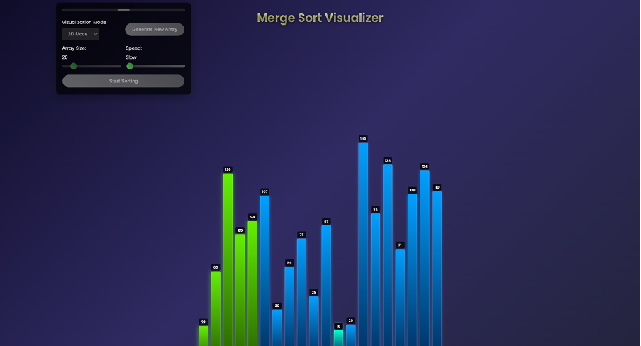
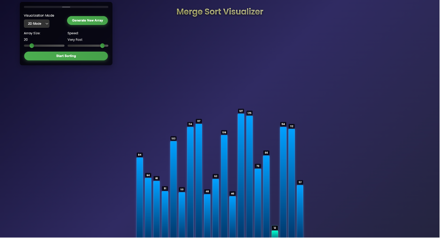

# Merge Sort Visualizer

An interactive visualization tool for the Merge Sort algorithm with both 2D and 3D viewing modes.



## Overview

A dynamic visualization tool that helps understand the merge sort algorithm through interactive 2D and 3D representations. Watch in real-time as the algorithm divides, sorts, and merges arrays.

## Features

- **Dual Visualization Modes**
  - 2D classic bar representation
  - 3D interactive visualization 
  - Smooth transitions between modes

   

  

- **Interactive Controls**
  - Adjustable array size (5-100 elements)
  - Variable sorting speed (Slow to Instant)
  - Draggable control panel
  - Generate new random arrays instantly

  

- **Visual Enhancements**
  - Color-coded bars for different states (comparing, merged, sorted)
  - Value labels on each bar
  - Special highlighting for small values
  - Smooth animations and transitions
  - Success animation upon completion


- **Performance Optimization**
  - Batch updates for high-speed sorting
  - Adaptive animation frames
  - Configurable delay settings

## Project Structure

```
mergesort_visualizer/
│
├── index.html          # Main HTML file
├── styles.css         # CSS styles
├── script.js         # Core JavaScript logic
│
├── images/      # Project screenshots
│   ├── visualizer.png
│   ├── 2d.png
│   ├── 3d.png
│   └── control.png
│
└── README.md        # Project documentation
```

## Technologies Used

- HTML5
- CSS3
- JavaScript (ES6+)
- Three.js for 3D visualization

## Demo

### Video Demo
[Watch the demo video](https://www.youtube.com/watch?v=dY6ranB06Ts)

### Live Demo
[Try it live](https://mergesort-visualizer.vercel.app/) <!-- Add your live demo link here -->


## Usage

1. Select visualization mode (2D/3D)
2. Adjust array size using the slider
3. Set sorting speed as needed
4. Click "Generate New Array" to create a new random sequence
5. Click "Start Sorting" to begin the merge sort visualization


## Algorithm Details

### Time Complexity
- Best Case: O(n log n)
- Average Case: O(n log n)
- Worst Case: O(n log n)

### Space Complexity
- O(n)

## Contributers
- Shreya Menon - 16010123324 - E2 batch
- Shreyans Tatiya - 16010123325 - E2 batch
- Siddhant Raut - 16010123331 - E2 batch

